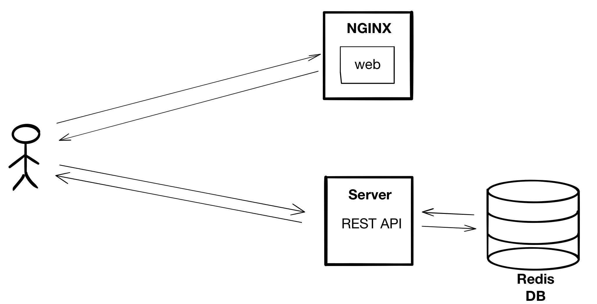

# Oracle Kubernetes Engine first steps

First steps with Docker, Kubernetes and Oracle Kubernetes Engine (OKE).

We are going to build, dockerize and deploy an application with this architecture.

What do we cover?

- Create a Kubernetes cluster with Oracle Cloud.
- Explain virtual machines, containers, Docker, registry, and Kubernetes.
- Dockerize your application
- Run your application locally.
- Configure `kubectl` to talk to your cluster.
- Deploy your application in OKE

---

## Virtual Machines

It is a **virtualization** of a computer system.

Through software, it **simulates the underlying hardward**. The software is called **hyper-visor**.

Examples: VirtualBox, QEMU, Hyper-V, VMWare, etc.

There are two types but they work in a similar way:

On top of that virtual system you **install a complete operative system**.

## Containers

**Lightweight virtualization technology** based on Linux kernel.

It produces **portable images** that you can run in any Linux host machine.

It has a **fast start time**.

The unterlying technology: `cgroups` and `namespaces` of Linux kernel.

- `cgroups` is "what you can use" from your host machine. Memory, CPU, block I/O, network, ...
- `namespaces` is "what you can see" from your host machine. Pid, net, mnt, uts, ipc, ...

### Why containers is useful

Compare virtual machines and containers stack:

Virtual Machines:

Containers 

It **streamline the pipeline** of development, testing and deployment of applications.

Developers can modify the code, run them in containers that isolate the execution from the local developer machine (**the end of "it works on my machine"**).

When developer is ready, it can push the code to the repository what kick off a remote building that **create container images** and **archive them in a repository of images**.

After that, Operations can **take those images and deployment** in testing and production enviroments.

The whole process is creating deliverables isolated from local hacks to make it work on a specific environment.

Because is a lightweight virtualization technology, spinning new containers from an image is quick and easy. Perfect to **scale your application on demand**.

## Docker

Docker is the most popular container technology. Docker is just a toolkit that abstract the complexity of `cgroups` and `namespaces`.

Docker images are composed by layers of modifications on top of based images.

## Kubernetes

Kubernetes is an **open-source** system for **automating deployment**, **scaling** and **management of containerized applications**. It groups containers that make up an application into logical units for easy management and discovery.

---

## Dockerize your application

Dockerfile contains the instructions to build a docker image.

Build your image:

`docker build -t oke-first-steps/web .`

## Run your application locally

Run locally a container from your image:

`docker run -p 4000:4000 -d oke-first-steps/web`

Tag an image:
`docker tag ...` XXX

## Push images to registry

Repository of Docker images, tagged with a version or code name.

Developers or CI tools can **push** images to the repository.

Kubernetes and developers can **pull** images to be run.

## Oracle Kubernetes Engine

XXX

## Deploy your containers

XXX

## Upgrade your application

XXX
