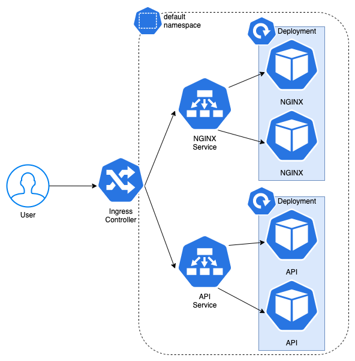

# Oracle Kubernetes Engine First Steps

First steps with Oracle Kubernetes Engine (OKE), a fully-managed kubernetes cluster.

We are going to build, dockerize and deploy on Kubernetes to show you how to modernize your application and be able to stay on top of your competitors.

## Key takeaways

- Understand concepts like virtual machines, containers, Docker, container registry, and Kubernetes.
- Create a Kubernetes cluster with Oracle Cloud.
- Dockerize your application.
- Configure `kubectl` to talk to your cluster.
- Deploy your application in Oracle Kubernetes Engine (OKE).
- Scale up and down your application
- Create an ingress controller (Work in progress...)

## Requirements

In order to follow this hands-on lab you need an active Oracle Cloud account.

If you don't have one already, what are you waiting for? You can create one on [Sign-up for a free Oracle Cloud account](http://bit.ly/34TzwGf).

Follow the steps and you will receive an email with details to log-in. Sometimes it might take few minutes to fully provision your account.

You will need a SSH public and private key.

> If you don't have SSH private and public key. Follow the steps on this [guide](https://docs.cloud.oracle.com/en-us/iaas/Content/Compute/Tasks/managingkeypairs.htm).

(Optional) If you want to test the Docker part locally, you will need Docker installed on your machine. Go to [Docker official](https://docs.docker.com/install/) page.

## Index

- [Lab 100: Set-up](./lab100/README.md)
- [Lab 200: Containers](./lab200/README.md)
- [Lab 300: Kubernetes](./lab300/README.md)
- [Lab 400: Ingress Controller](./lab400/README.md)

## Ready to dive in

[Let's get started with Lab 100: Set-up](./lab100/README.md)
