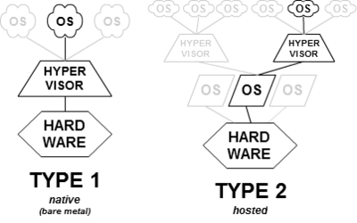
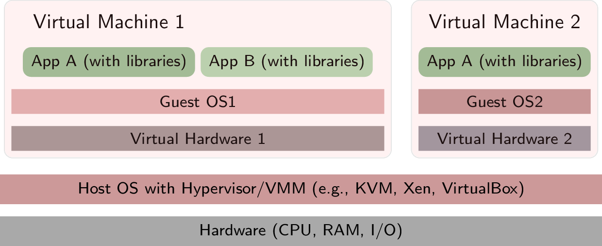
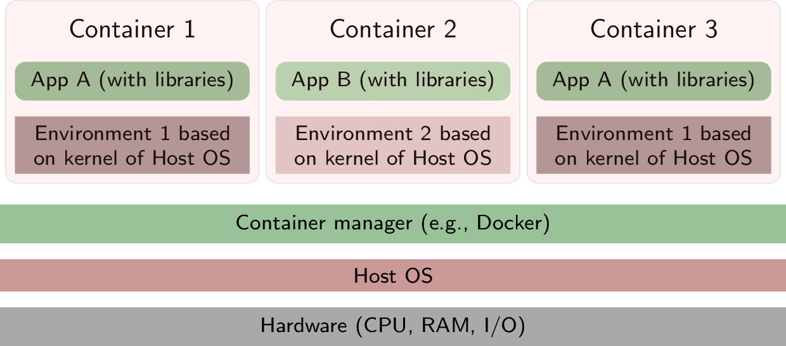
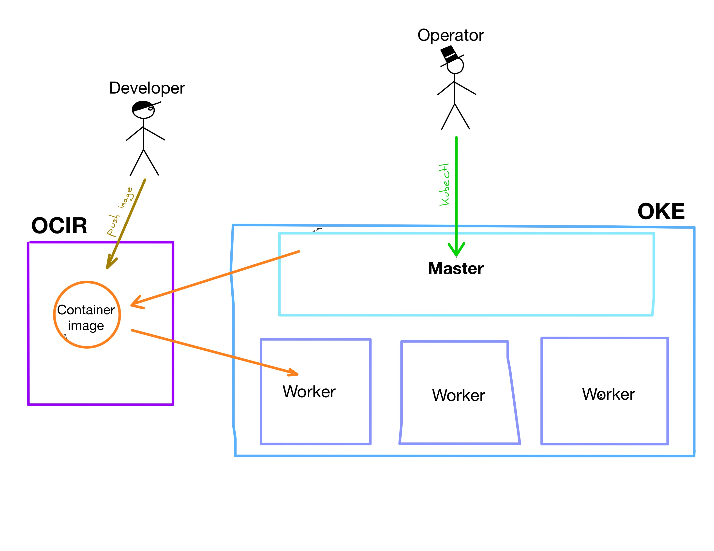

# Lab 200: Containers

## Virtual Machines

It is a **virtualization** of a computer system.

Through software, it **simulates the underlying hardward**. The software is called **hyper-visor**.

Examples: **VirtualBox**, **KVM**, **QEMU**, **Hyper-V**, **VMWare**, etc.

There are two types but they work in a similar way:

On top of that virtual system you **install a complete operative system**.

## Containers

**Lightweight virtualization technology** based on Linux kernel.

It produces **portable images** that you can run in any Linux host machine.

It has a **fast start time**.

The underlying technology is: `cgroups` and `namespaces` of Linux kernel.

- `cgroups` is "what you can use" from your host machine. Memory, CPU, block I/O, network, ...
- `namespaces` is "what you can see" from your host machine. Pid, net, mnt, uts, ipc, ...

### Why containers are useful

Compare virtual machines and containers stack:

|                  Virtual Machines                   |               Containers                |
| :-------------------------------------------------: | :-------------------------------------: |
|  |  |

It **streamlines the pipeline** of development, testing and deployment of applications.

Developers can modify the code, run them in containers that isolate the execution from the local developer machine (**the end of "it works on my machine"**).

When a developer is ready, she can push the code to the repository what kick off a remote building that **create container images** and **archive them in a repository of images**.

After that, Operations can **take those images and deployment** in testing and production enviroments.

The whole process is creating deliverables isolated from local hacks to make it work on a specific environment.

Because is a lightweight virtualization technology, spinning new containers from an image is quick and easy. Perfect to **scale your application on demand**.

## Docker

Docker is the most popular container technology. Docker is just a toolkit that abstract the complexity of `cgroups` and `namespaces`.

Docker images are composed by **layers** of modifications on top of based images.

## Dockerize your application

Dockerize your application means to **wrap your application, libraries and configuration** in a docker image that can be run later.

You can attach some configuration to your image but you still can modify that configuration with **environment variables** at run time.

You define the container image  with a **Dockerfile**. Dockerfile contains the instructions to build a docker image.

## Build your container images

Build your image for the web:

`cd src/web`

`docker build -t oke/web .`

Build your image for the server:

`cd src/server`

`docker build -t oke/server .`

Check that the images are created with:

`docker images | grep oke`

Can you see the **size** of the images? It is smaller than a full virtual machine image. That is really good news!

## Run your application locally

Run locally a container from your images:

`docker run -d --name server -p 3000:3000 --rm oke/server`

`docker run -d --name web -p 80:80 --rm oke/web`

## Test the applications

Server health 

`curl -s localhost:3000/health | jq .`

Web running on:
[localhost](http://localhost)

## Pull and push images

Registry is a repository of container images, tagged with a version or code name.

Developers or CI tools can **push** images to the repository.

Kubernetes and developers can **pull** images to be run.

> Try it yourself!
> 
> Pull an image:
> `docker pull docker/whalesay`
> 
> Run the image:
> 
> `docker run --name whale --rm docker/whalesay cowsay "Say no to one-use plastic, hooman"`

Login with your Docker into OCI registry:

> You must have an Auth Token to use with Oracle Cloud Infrastructure Registry

`docker login -u <tenancy-name>/<email> fra.ocir.io`

List of regional names and codes for OCI registry:

|  Region   | Code  | Registry URL |
| :-------: | :---: | :----------: |
| Frankfurt |  fra  | fra.ocir.io  |
|  London   |  lhr  | lhr.ocir.io  |
|  Ashburn  |  iad  | iad.ocir.io  |
|  Phoenix  |  phx  | phx.ocir.io  |

_Full list of regions and codes [here](https://docs.cloud.oracle.com/iaas/Content/Registry/Concepts/registryprerequisites.htm#Availab)!_

When you create a Auth Token in `Identity > Users > <your-user> > Auth Token`, the passcode generated is the password prompted here.

> If your user is federated with Oracle Identity Cloud Service, use the following pattern for your username:
> 
> \<tenancy-name\>/oracleidentitycloudservice/\<email\>

## Example with Whalesay (docker demo image)

Tag an image for OCI registry:

`docker tag docker/whalesay fra.ocir.io/<tenancy_name>/oke/whalesay:latest`

Push the tagged image to OCI registry:

`docker push fra.ocir.io/<tenancy_name>/oke/whalesay`

## Now with out applications

Let's try to tag and push our web and server now.

- `docker tag oke/server fra.ocir.io/<tenancy_name>/oke/server:beta`

- `docker tag oke/web fra.ocir.io/<tenancy_name>/oke/web:beta`

Check images with `docker images | grep oke`

- `docker push fra.ocir.io/<tenancy_name>/oke/server`

- `docker push fra.ocir.io/<tenancy_name>/oke/web`

Ready to go to the next lab!

---

Next [Lab 300: Kubernetes](../lab300/README.md)

[Go back Home](../README.md)
