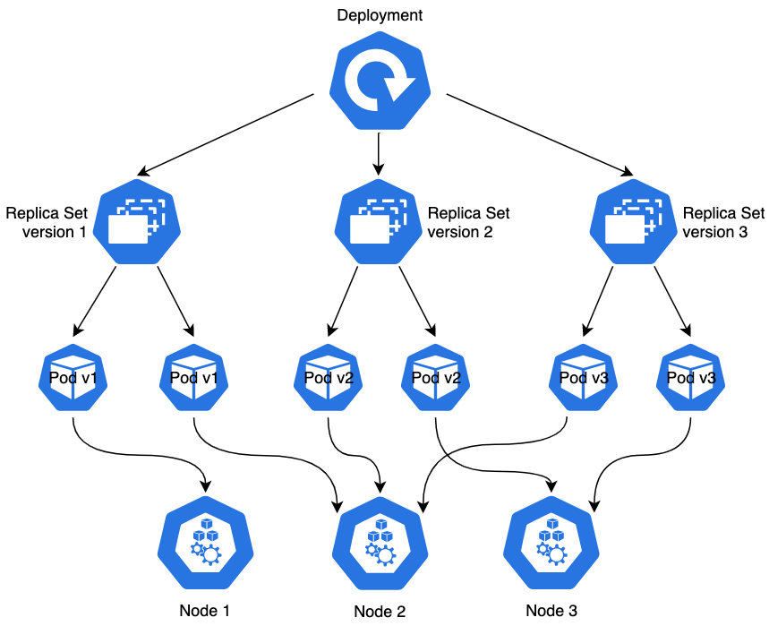
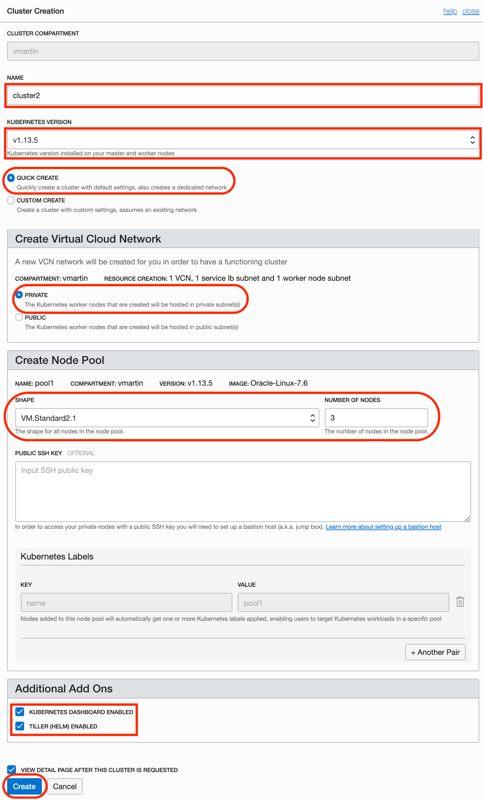

# Lab 300

## Kubernetes

Kubernetes is an **open-source** system for **automating deployment**, **scaling** and **management of containerized applications**. It groups containers that make up an application into logical units for easy management and discovery.

### Kubernetes components (some of them)

- **Pod** is the smallest deployable object in Kubernetes. Containers run inside to do just one job. The pod doesn't make sense without all of those containers running.
- **Deployment** is a declaration of the topology of your application for Pods and other Kubernetes object models.
- **Service** is an abstract way to expose an application running on a set of Pods as a network service.
- **Namespaces** are virtual clusters inside of the Kubernetes cluster to separate different products, projects or departments.

## Oracle Kubernetes Engine

Create Kubernetes Cluster: `Developer Services > Container Cluster (OKE)`

Follow the steps of `Quick Start` and connect with Kubernetes Dashboard.

## Pull OCI Registry private images

Kubernetes has to pull images from OCI Registry, and for that has to authenticate against the registry.

We need to create a secret on our Kubernetes Cluster to do so:

`kubectl create secret docker-registry <secret-name> --docker-server=<region-code>.ocir.io --docker-username='<tenancy-namespace>/<oci-username>' --docker-password='<oci-auth-token>' --docker-email='<email-address>'`

- `<secret-name>`: any descriptive name you like
- `<region-code>.ocir.io`: OCI registry service URL, e.g. lon.ocir.io
- `<tenancy-namespace>/<oci-username>`: tenancy and username/email
- `<oci-auth-token>`: under Identity > User > your user, you can create a Auth Token that goes here
- `<email-address>`: your email

---

Next [Lab 400: XXX](../lab400/README.md)

[Go back Home](../README.md)
