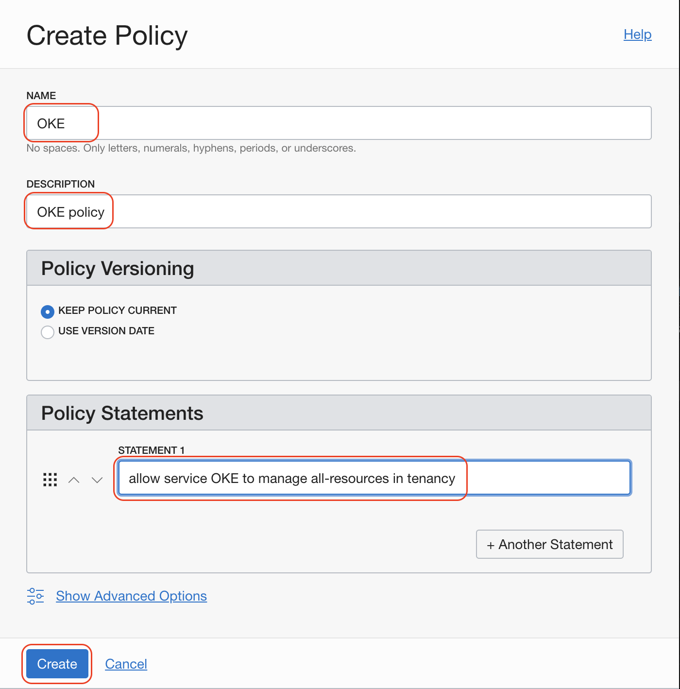

# Lab 300: Kubernetes

Kubernetes is an **open-source** system for **automating deployment**, **scaling** and **management of containerized applications**. It groups containers that make up an application into logical units for easy management and discovery.

## Kubernetes components (some of them)

- **Pod** is the smallest deployable object in Kubernetes. Containers run inside to do just one job. The pod doesn't make sense without all of those containers running.
- **Deployment** is a declaration of the topology of your application for Pods and other Kubernetes object models.
- **Service** is an abstract way to expose an application running on a set of Pods as a network service.
- **Namespaces** are virtual clusters inside of the Kubernetes cluster to separate different products, projects or departments.


## Oracle Kubernetes Engine

We need to add a policy to enable service OKE to manage all resources in the tenancy. This is to enable the service to create node workers and other network resources.

Go to:




This is the statement to paste:

`allow service OKE to manage all-resources in tenancy`

Now, it is time to create our Kubernetes Cluster:


Select a name, the compartment (root compartment is fine for the hands-on lab)


Review the creation and confirm.

## Install kubectl on your linux machine

Go to [Kubernetes intall Kubectl on Linux](https://kubernetes.io/docs/tasks/tools/install-kubectl/#install-kubectl-on-linux) but to install the stable version you just type this:

```
curl -LO https://storage.googleapis.com/kubernetes-release/release/`curl -s https://storage.googleapis.com/kubernetes-release/release/stable.txt`/bin/linux/amd64/kubectl
```

Then make kubectl executable and move it to the final folder:

`chmod +x ./kubectl && sudo mv ./kubectl /usr/local/bin/kubectl`

Check everything went well:

`kubectl version --client`

Scroll down on the Kubernetes cluster detail page and follow the steps of `Quick Start` and connect with Kubernetes Dashboard.


---

I'm glad you like it so far, the [next lab](../lab400/README.md) is a work in progress, don't hesitate to collaborate with issues and  Pull Request. Thanks.

[Go back Home](../README.md)
